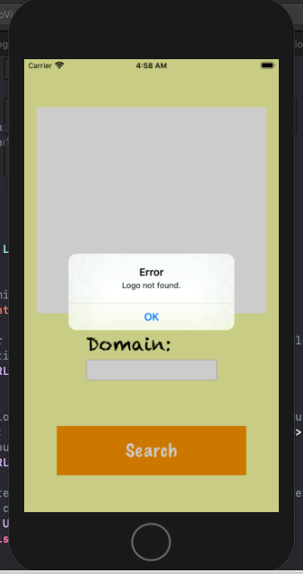
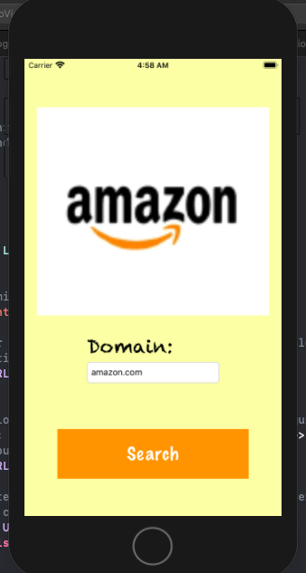

# LogoViewer-IOS
Logo Viewer

Il s'agit d'une application IOS qui permet d'afficher le logo d'une entreprise a partir de son "Domain Name" entre par l'utilisateur dans un input de type texte, cette application communique avec une Api distante qui met a notre disposition les logos des entreprises en fonction de leurs no de domaine.

<h2>Launch screen</h2>

<h2>Home Page</h2>

<h2>
Failure</h2>

<h2>Success</h2>

